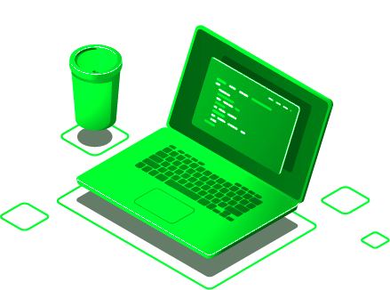
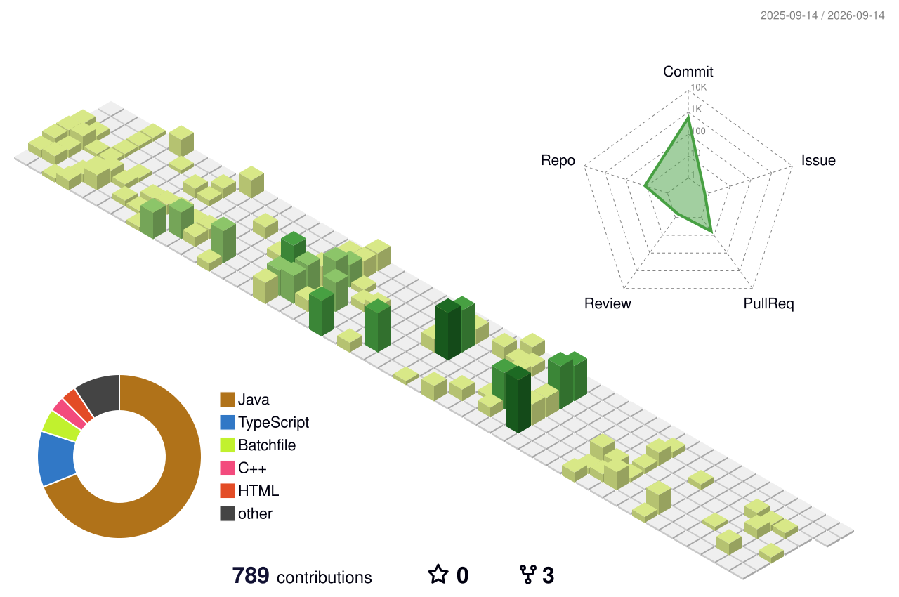

  <!-- Terminal Typing Effect -->
  _++SYSTEM++BOOTING...;>_++MATHEUS++NUNES++DA++SILVA;>_++BACKEND++DEVELOPER;>_++IOT++%26++AI++ARCHITECT" alt="Typing SVG" />

  

    
    
    
    
    
  

  

    
    
    
  

  

---

## 👨‍💻 _[USER_MINDSET_]

 
  <b>&gt;_ HELLO WORLD; EU SOU MATHEUS NUNES</b>  
  Sou um <b>Desenvolvedor Backend / Fullstack</b> com viés forte de engenharia e base muito sólida em <b>Java & Spring</b>. Minha trajetória se formou pela curiosidade de entender os sistemas de ponta a ponta, descendo até "o metal" com meus projetos em <b>IoT e Hardware</b>.

  👾 <b>O que estou fazendo agora?</b> 
  Atualmente curso <b>Ciência da Computação (UNIP)</b> e busco o nível tático da <b>Engenharia de Sistemas Inteligentes</b>. Meu foco não é só usar IA, mas no Backend construir a <i>arquitetura de missão crítica</i> que a suporta.

  🚀 <b>Princípios e Foco:</b> 
  Pragmatismo na fundação da arquitetura, código sempre limpo e ponte entre o mundo corporativo de alta escala e a inovação veloz das IAs.

 

---

## 🛠️ _[TECH_STACK_]

   
  <b><code style="color: #00FF41;">[CORE_BACKEND]</code></b> 
  
  
  
  

  <b><code style="color: #00FF41;">[DATABASE_&_CLOUD]</code></b> 
  
  
  
  
  

  <b><code style="color: #00FF41;">[AI_&_IOT]</code></b> 
  
  
  
  

  <b><code style="color: #00FF41;">[FRONTEND_&_TOOLS]</code></b> 
  
  
  
  

---

## 🏆 _[MAIN_PROJECTS_]

<table>
  <tr>
    <td width="50%" valign="top">
      <h3>
        🏥 InfraMed  
      </h3>
      

        
        
        
        
        
      

      
<b>Gestão e Monitoramento Hospitalar</b>

      
Integra prontuário médico com hardware IoT. Sensores num <b>ESP32</b> enviam dados via C++, processados localmente em Java, atualizando painéis médicos no Angular.

      <a href="https://github.com/matheus05dev/InfraMed-Back-End"><code>[🔗 Back-End]</code></a> <a href="https://github.com/matheus05dev/InfraMed-Front-End"><code>[🔗 Front-End]</code></a> 
      <a href="https://github.com/matheus05dev/InfraMed-IoT"><code>[🔗 IoT/ESP32]</code></a> <a href="https://github.com/matheus05dev/InfraMed-Simulador-de-IoT"><code>[🔗 Simulador]</code></a>
    </td>
    <td width="50%" valign="top">
      <h3>
        🧠 MindForge  
      </h3>
      

        
        
        
        
      

      
<b>Gestão de Conhecimento com IA</b>

      
Plataforma SaaS Multi-tenant e Fullstack. Orquestra LLMs, RAG e Agentes Web no backend, servindo uma interface guiada por React.

      <a href="https://github.com/matheus05dev/mindforge-api"><code>[🔗 Acesso ao Backend]</code></a>  
      <a href="https://github.com/matheus05dev/mindforge-front"><code>[🔗 Acesso ao Frontend]</code></a>
    </td>
  </tr>
  <tr>
    <td width="50%" valign="top">
      <h3>
        ☕ Café Aroma & Sabor  
      </h3>
      

        
        
        
        
      

      
<b>Gestão Comercial e Estoque</b>

      
Sistema clássico focado em segurança granular. Renderização SSR utilizando Java, Thymeleaf e Bootstrap provando domínio de negócio puro.

      <a href="https://github.com/matheus05dev/Cafe-Aroma-Sabor"><code>[🔗 Acesso ao Repositório]</code></a>
    </td>
    <td width="50%" valign="top">
      <h3>
        🚀 Grevia API  
      </h3>
      

        
      

      
<b>API Profissional em Java</b>

      
Solução robusta em Spring Boot com foco na construção de endpoints rest, lógica de negócios avançada e boas práticas focadas no Clean Code.

      <a href="https://github.com/matheus05dev/grevia-api"><code>[🔗 Acesso ao Repositório]</code></a>
    </td>
  </tr>
  <tr>
    <td colspan="2" valign="top">
      <h3>
        🏆 Programação Competitiva & Algoritmos  
      </h3>
      

        
        
        
      

      
<b>Repositório Base para Maratonas (ICP, SBC, UVa)</b>

      
Acervo central de implementações de alta performance para resolução de problemas matemáticos e de algoritmos (como Divisão e Conquista, Grafos, etc). Demonstra meu domínio em complexidade de tempo (Big-O) e Estruturas de Dados exigidos em ambientes competitivos reais.

      <a href="https://github.com/matheus05dev/Programacao-Competitiva"><code>[🔗 Acesso ao Repositório Core]</code></a>
    </td>
  </tr>
</table>

---

## 📈 _[GITHUB_TELEMETRY_]

  <!-- 3D Isometric Commits History (Gerado via Actions) -->
  

 

  <!-- Languages Donut Chart -->
  
  <!-- Streak Stats -->
  

---

  
&nbsp;<b><code style="color: #00FF41; font-size: 16px;">[ + EXECUTE: ./VIEW_CERTIFICATIONS_AND_EDUCATION.sh ]</code></b>

   
  <table>
    <tr>
      <td width="50%" valign="top">
        <h3>
          
          
        </h3>
        
<b>Cloud Computing</b> 
        • AWS Cloud Foundations (2023) 
        • GCP App Dev Environment (2025)

      </td>
      <td width="50%" valign="top">
        <h3>
          
          
        </h3>
        
<b>Redes & Cybersegurança</b> 
        • OWASP Top 10 Secure Coding (2026) 
        • Networking Basics & Intro to Cybersec

      </td>
    </tr>
    <tr>
      <td width="50%" valign="top">
        <h3>
          
        </h3>
        
<b>Ensino Superior (UNIP Sorocaba)</b> 
        • Bacharelado em Ciência da Computação (2026 - 2029) 
        • 🏆 <b>Competidor Oficial:</b> Maratona de Programação SBC (2026) 
        • 📄 <b>Autor (CTUS 2026):</b> <i>Humanização e Governança de IA em UTI: Segurança Algorítmica na Decisão Clínica</i>

      </td>
      <td width="50%" valign="top">
        <h3>
          
        </h3>
        
<b>Formação Técnica e Hardware</b> 
        • Arduino: Fundamentos de IoT (2025) 
        • Técnico em Desenv. de Sistemas (2024-2025)

      </td>
    </tr>
  </table>

 

  <i>"Talk is cheap. Show me the code."</i> <b>– Linus Torvalds</b>

<!-- Footer Spacer -->

   
  <code>[CONNECTION TERMINATED]</code>

